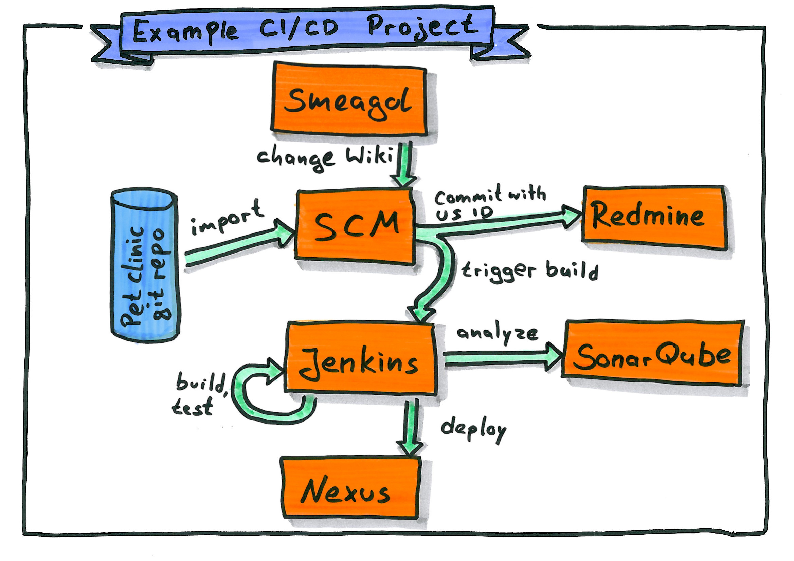

# Cloudogu EcoSystem Pet Clinic Demo

Welcome to the Smeagol part of the Pet Clinic demo! This project is based on the famous Spring Pet Clinic sample application. But there is even more: This demo showcases the interaction within a Cloudogu EcoSystem development pipeline.

## Interaction

Before you start, here is what you have already at hand:

- SCM Manager contains a `git` repo with
    - the Pet Clinic demo code
    - the Smeagol wiki pages that you are currently reading
    - Jenkins pipeline definition
    - Redmine integration
- Jenkins contains
    - a pipeline project
    - SonarQube tool configuration
    - Nexus tool configuration
- Redmine contains a project with a development ticket

Now comes the part where we commit a change to demonstrate the ease-of-use when all parts in the build pipeline work together. We have all the tools of the trade ready, so this is what is going to happen:

1. Commit and push a change into a `git` repo.
    - Change a wiki page by clicking on and save it.
    - This results in a  
1. **Jenkins** notices the change and starts a pre-defined CI/CD Pipeline: 
   - trigger the builds 
   - runs Unit and Integration tests
   - deploys artifacts to **Nexus** repos
1. **SonarQube** analyzes your project on each change
1. **Redmine** tracks your User Stories 
1. **SCM Manager**
   - accommodates your repositories
   - also notifies Redmine about ticket mentions in your commit messages

1. **Smeagol** provides an easy-to-use Wiki backed by this git repo
   - have your code and your docs in the same place! 
   - For the purpose of demonstration, we change a Smeagol wiki page 
   - This 

Smeagol supports also embedded PlantUML:

@startuml
Bob -> Alice : hello
@enduml
